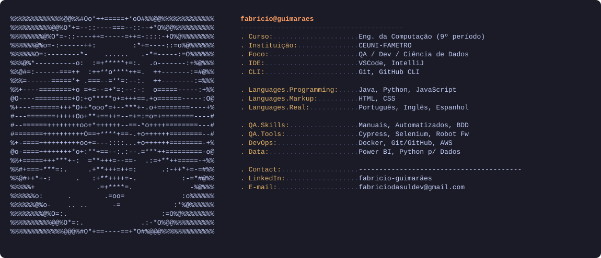

  

---

### 🚀 Sobre mim

- 🎓 Estudante de Engenharia da Computação (9º período)
- 🧪 Buscando estágio em **Desenvolvimento** ou **Testes de Software (QA)**
- 🔭 Aprofundando estudos em **Java**, **Python** e **JavaScript**
- 📊 Migrando também para **Ciência de Dados**
- 💬 Idiomas: Português (fluente), Inglês (intermediário), Espanhol (básico)

---

### 🛠️ Tecnologias e ferramentas

---

### 📊 Estatísticas do GitHub

---

### 📌 Projetos em destaque

| Projeto | Descrição |
|---|---|
| **Mercadin Regional** | Plataforma de comércio local em desenvolvimento |
| **Plim!** | App para motoristas de aplicativo (Uber/99) |
| **SmokEyes** | Identificação de vulnerabilidades em código gerado por IA |
| **Smart Watt** | Sistema de controle de energia remoto |
| **Cardápio Digital** | Cardápio via WhatsApp para comércio local, sem gateway de pagamento |

---

*"Sempre em busca de aprendizado e novos desafios."*

